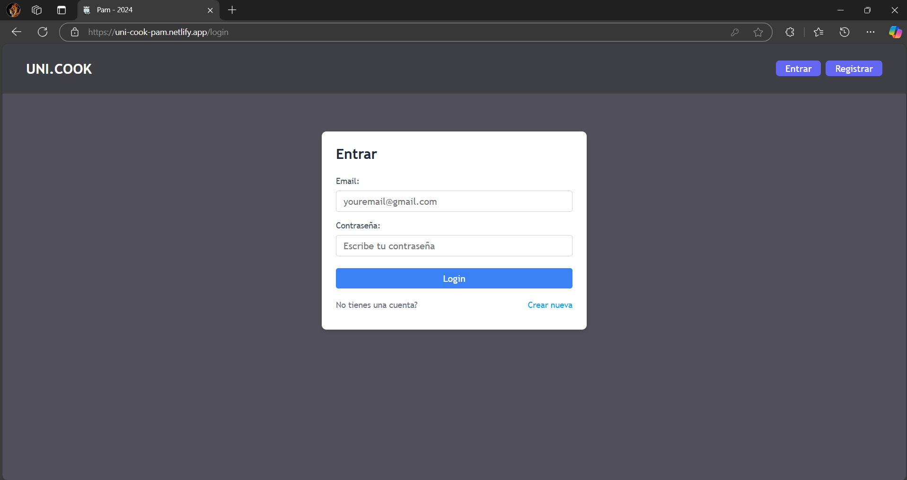
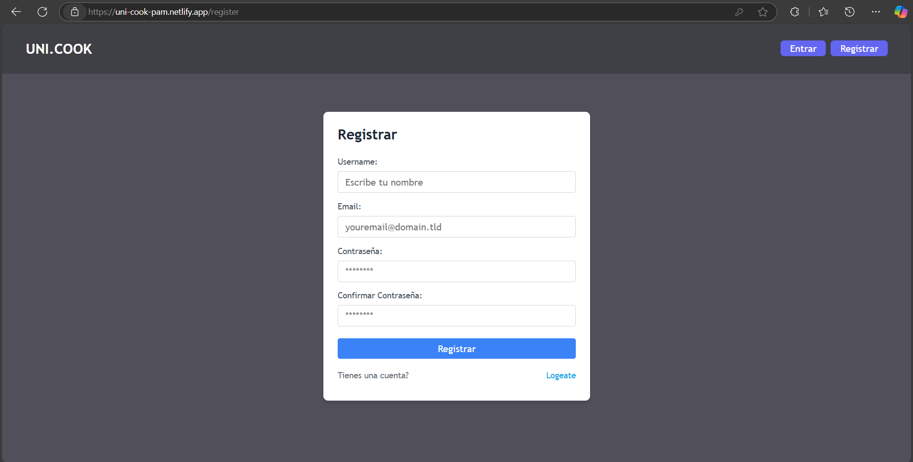
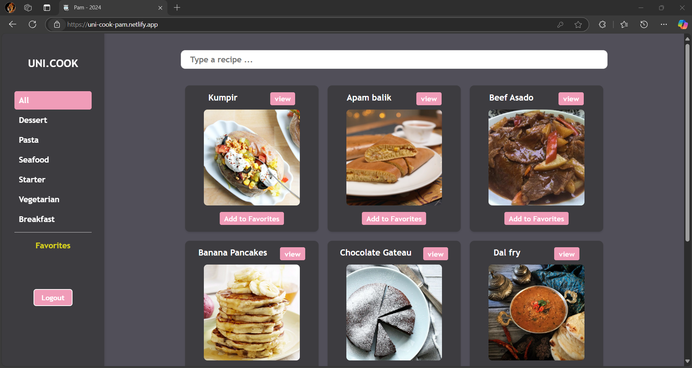
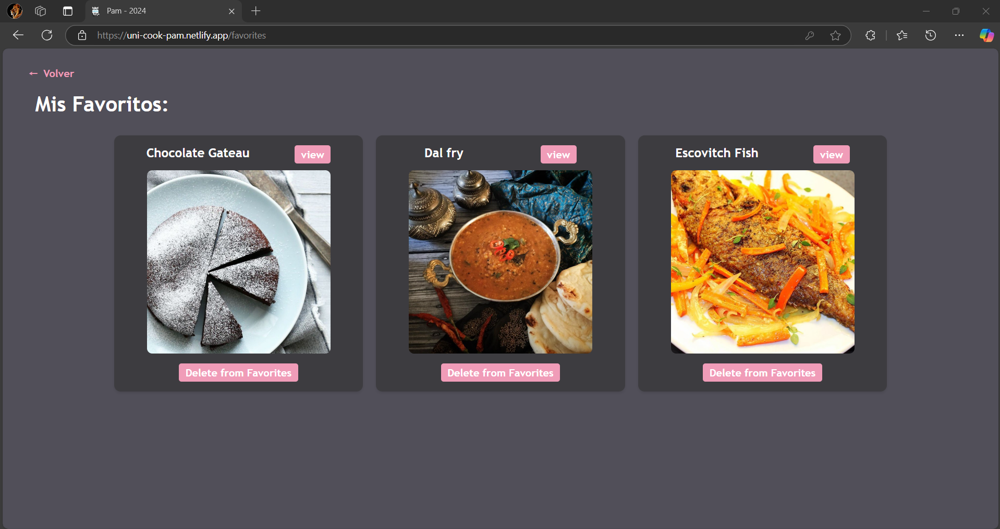
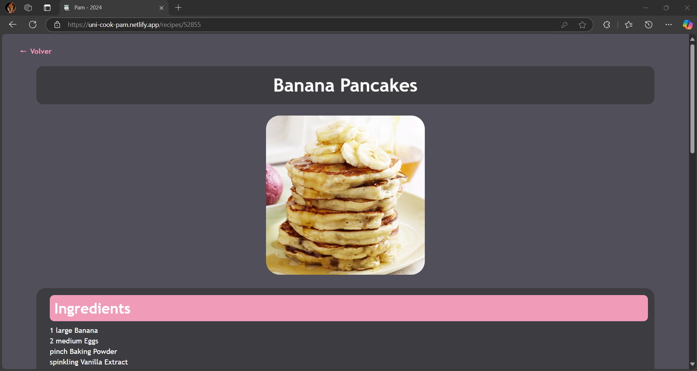
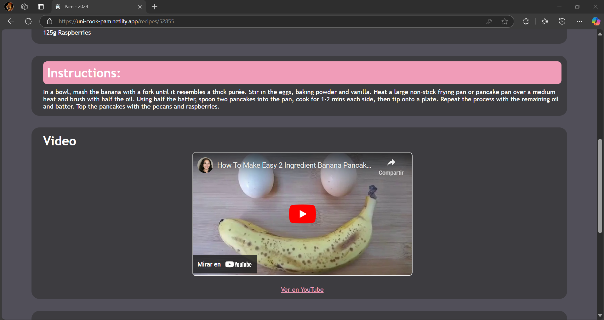
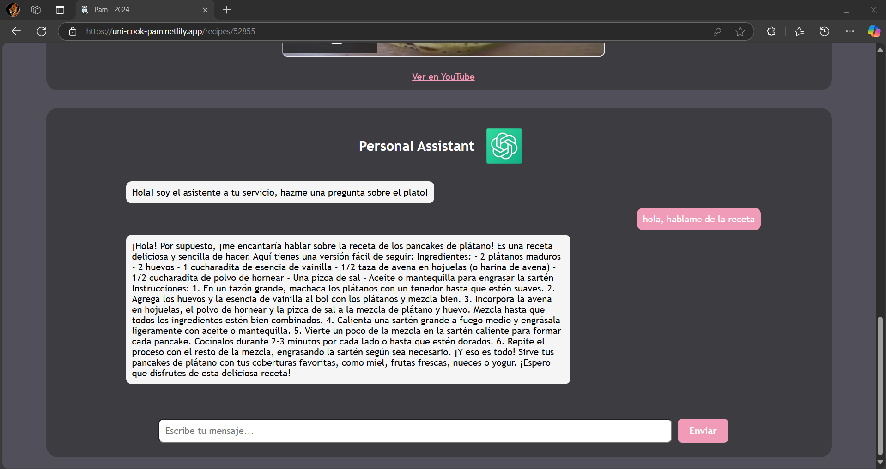

# Food Recipes  
The following project consists of a food recipe search engine, where the user can type in a recipe and thanks to an external api, be able to find it and get the process to make it, we also have implemented an Assistant using an API of Open AI which you may answer him whatever questions you have realted with an specifict recipe you are viewing

### Technologies used:  
- Express
- Node
- React  
  
    
### API used:  
- [TheMealDB](https://www.themealdb.com/api.php)
- [OpenAI](https://platform.openai.com/docs/quickstart)  
  
### Developers:  
- [Juan Silva](https://github.com/JuanSilva2000)
- [Piero Pilco](https://github.com/pieropr2k)
  
### Steps to run the proyect  
  
1. Clone the Repository with:  
```git
    git clone https://github.com/JuanSilva2000/PAM.git
```
  
2. Install the dependecies used to the backend:  
```git
    npm install
```

3. Run the backend:  
```git
    npm run dev
```

4. Open a new terminal and move to frotend file and install its dependecies
```git 
    cd frontend  
    npm install
```  
  
5. Run the frontend and open in the browser the localhost in the given port:  
```git  
    npm run dev
```   
  
## Browser result  
  
### Login   

  
  
### Register  
  
  
  
  
### Main Page  
  
  
  
### Favorite Page  
  
  
  
### View of a Recipe  

  

  

Assitant AI:  
    
